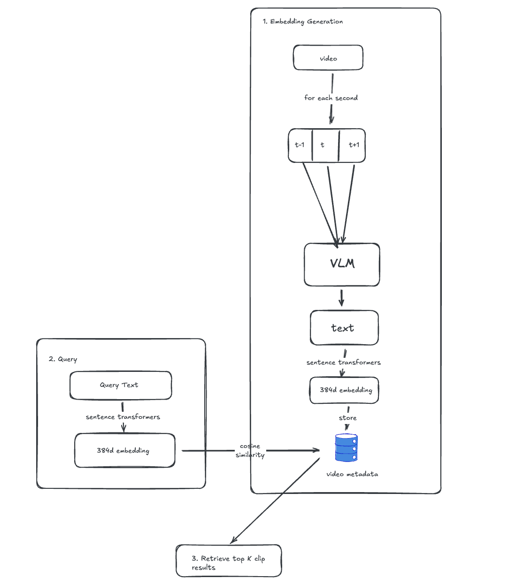

# Semantic Video Search

A powerful AI-powered video analysis and semantic search application built with Streamlit and LiquidAI's vision-language models. Upload videos or provide YouTube URLs to analyze frame-by-frame content and search through your video using natural language queries.

## What This Application Does

Semantic Video Search allows you to:

1. **Analyze Videos**: Upload local video files or download from YouTube
2. **AI-Powered Frame Description**: Uses LiquidAI's LFM2-VL-450M vision-language model to describe each frame with temporal context
3. **Smart Filtering**: Automatically skips similar/redundant frames to save processing time
4. **Semantic Search**: Find specific moments in your video by searching with natural language
5. **Clip Extraction**: Automatically extract and download video clips around search results

## Features

### Video Analysis Tab
- **Multiple Input Methods**: Upload video files (MOV, MP4, AVI, MKV, MPEG4) or paste YouTube URLs
- **Smart Filtering**: VLM-based intelligent filtering that detects frame changes and skips similar content
- **Temporal Context**: Analyzes frames with before/current/after context for better descriptions
- **Progress Tracking**: Real-time progress bar and status updates during processing
- **Export Results**: Download analysis as JSON for later use

### Search & Clips Tab
- **Semantic Search**: Search by meaning, not just keywords
- **Similarity Scores**: See how closely each result matches your query
- **Automatic Clip Extraction**: Extract video clips around matching frames
- **Configurable Settings**: Adjust clip padding and number of results

## AI Models Used

| Model | Purpose | Size |
|-------|---------|------|
| `LiquidAI/LFM2-VL-450M` | Vision-Language Model for frame description | 450M params |
| `sentence-transformers/all-MiniLM-L6-v2` | Embedding model for semantic search | 22M params |

## Architecture

The system follows a three-stage pipeline for semantic video search:



### 1. Embedding Generation
- **Video Input**: Takes a video file (uploaded or from YouTube)
- **Frame Extraction**: Extracts one frame per second with temporal context (t-1, t, t+1)
- **VLM Processing**: LFM2-VL-450M vision-language model describes each frame in natural language
- **Embedding Creation**: Sentence transformers convert descriptions to 384-dimensional embeddings
- **Storage**: Frame metadata and embeddings are stored for retrieval

### 2. Query Processing
- **Query Text**: User enters a natural language search query
- **Query Embedding**: Same sentence transformer converts query to 384d embedding

### 3. Retrieval
- **Cosine Similarity**: Computes similarity between query embedding and all frame embeddings
- **Top-K Results**: Returns the most relevant video clips based on semantic similarity

## Project Structure

```
Semantic-Video-Search/
├── main.py              # Main Streamlit application
├── utils.py             # Model loading, video processing, search functions
├── styles.py            # CSS styles and HTML templates
├── requirements.txt     # Python dependencies
├── animation.json       # Lottie animation for UI (optional)
└── flowchart.png        # Architecture diagram
```

## Installation

### Prerequisites
- Python 3.10+
- GPU recommended (CUDA-compatible) for faster inference
- ~8GB RAM minimum (16GB recommended)

### Setup

1. **Clone and navigate to the project directory**:
   ```bash
   git clone https://github.com/yourusername/Semantic-Video-Search.git
   cd Semantic-Video-Search
   ```

2. **Create a virtual environment**:
   ```bash
   python -m venv venv
   source venv/bin/activate  # macOS/Linux
   .\venv\Scripts\activate   # Windows
   ```

3. **Install dependencies**:
   ```bash
   pip install -r requirements.txt
   ```

## How to Run

1. **Start the application**:
   ```bash
   streamlit run main.py
   ```

2. **Open in browser**: App opens at `http://localhost:8501`

3. **Analyze a video**:
   - Go to "Analyze Video" tab
   - Upload a video file OR paste a YouTube URL
   - Enable/disable Smart Filtering
   - Click "Analyze Video" or "Download & Analyze"

4. **Search your video**:
   - Navigate to "Search & Clips" tab
   - Enter a natural language search query
   - Click "Search"
   - View results and download extracted clips

## Example Queries

- `"person explaining mathematical equations"`
- `"code on screen"`
- `"handwritten notes"`
- `"diagram or flowchart"`
- `"introduction or title slide"`

## Configuration Options

### Smart Filtering
- **Enabled**: Skips similar frames (faster)
- **Disabled**: Processes all frames (more comprehensive)

### Search Settings
- **Clip Padding**: Seconds before/after matching frame (default: 3.0s)
- **Number of Results**: Top matches to return (default: 3)

## Output Format

```json
{
  "video_name": "example_video.mp4",
  "total_frames": 45,
  "smart_filtering_enabled": true,
  "frames": [
    {
      "frame_number": 1,
      "timestamp_seconds": 0.0,
      "timestamp_formatted": "00:00",
      "description": "Person standing in front of whiteboard...",
      "embedding": [0.123, -0.456, ...]
    }
  ]
}
```

## System Requirements

### Minimum
- CPU: 4 cores
- RAM: 8GB
- Storage: 5GB free
- Python 3.10+

### Recommended
- GPU: NVIDIA with 6GB+ VRAM
- RAM: 16GB+

## Troubleshooting

**Models not loading**: Check internet connection for first-time model download

**Out of memory**: Close other apps, process shorter videos, or disable smart filtering

**YouTube download fails**: Update yt-dlp: `pip install --upgrade yt-dlp`

## Key Dependencies

- `streamlit` - Web framework
- `transformers` - Hugging Face models
- `sentence-transformers` - Embedding models
- `torch` - PyTorch
- `opencv-python` - Video processing
- `yt-dlp` - YouTube downloading

## Acknowledgments

- [LiquidAI](https://www.liquid.ai/) for LFM2 vision-language models
- [Sentence Transformers](https://www.sbert.net/) for embedding models
- [Streamlit](https://streamlit.io/) for the web framework
